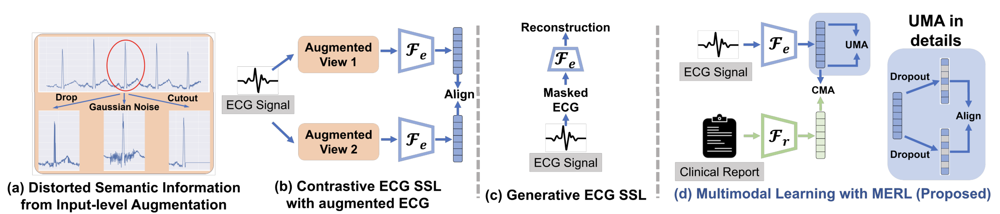

## MERL
[Zero-Shot ECG Classification with Multimodal Learning and Test-time Clinical Knowledge Enhancement](https://arxiv.org/abs/2403.06659), ICML 2024.



###  Installation
To clone this repository:
```
git clone https://github.com/cheliu-computation/MERL.git
```
To install Python dependencies:
```
pip install -r requirements.txt
```

### Dataset downloading
Datasets we used are as follows:
- **MIMIC-IV-ECG**: We downloaded the [MIMIC-IV-ECG](https://physionet.org/content/mimic-iv-ecg/1.0/) dataset as the ECG signals and paired ECG reports.

- **PTB-XL**: We downloaded the [PTB-XL](https://physionet.org/content/ptb-xl/1.0.3/) dataset which consisting four subsets, Superclass, Subclass, Form, Rhythm.

- **CPSC2018**: We downloaded the [CPSC2018](http://2018.icbeb.org/Challenge.html) dataset which consisting three training sets. 

- **CSN(Chapman-Shaoxing-Ningbo)**: We downloaded the [CSN](https://physionet.org/content/ecg-arrhythmia/1.0.0/) dataset.

After downloading datasets, please check the details of preprocessing in `finetune/readme.md`.

### Data Preprocessing
We preprocessed these datasets and split the dataset into train/val/test set using the code in `finetune/preprocess.ipynb`.\
We also provide the train/val/test split csv file in `finetune/data_split`

### Pre-training

We pre-trained MERL on MIMIC-IV-ECG using this command:

```
bash MERL/pretrain/launch.sh
```

Pre-trained models can be found [here](https://github.com/cheliu-computation/MERL)(Coming soon).

### Finetune on downstream tasks
We evlauate the performance of MERL on three scenarios: zero-shot classification, linear probing, and domain transferring.

#### zero-shot classification
We evaluate linear classification performance of our model using this command:
```
cd MERL/zeroshot/sub_script
bash run_all_transfer.sh
```
We can use `--dataset` to set specific dataset for finetuning. Here, 3 datsets are available: chexpert, rsna and covidx.
We can use `--data_pct` to set the fraction of training data for finetuning.

#### linear probing
We provide bash script for evaluating linear probing performance of MERL:
```
cd MERL/finetune/sub_script
bash run_all_linear.sh
```

#### domain transferring
We evaluate semantic segmentation performance of our model using this command:
```
cd MERL/transfer/sub_script
bash run_all_transfer.sh
```

### TODO List
- [ ] Upload Pre-train code.
- [ ] Upload zeroshot code.
- [ ] Upload linear probing code.
- [ ] Upload domain transferring code.
- [ ] Upload Pre-trained Model.

### Reference
If you found our work useful in your research, please consider citing our works(s) at:
```bash
@article{liu2024zero,
  title={Zero-Shot ECG Classification with Multimodal Learning and Test-time Clinical Knowledge Enhancement},
  author={Liu, Che and Wan, Zhongwei and Ouyang, Cheng and Shah, Anand and Bai, Wenjia and Arcucci, Rossella},
  journal={arXiv preprint arXiv:2403.06659},
  year={2024}
}
```
